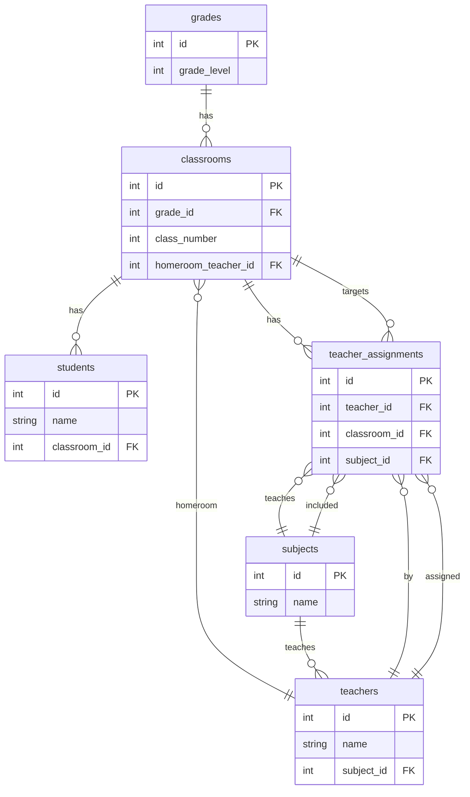
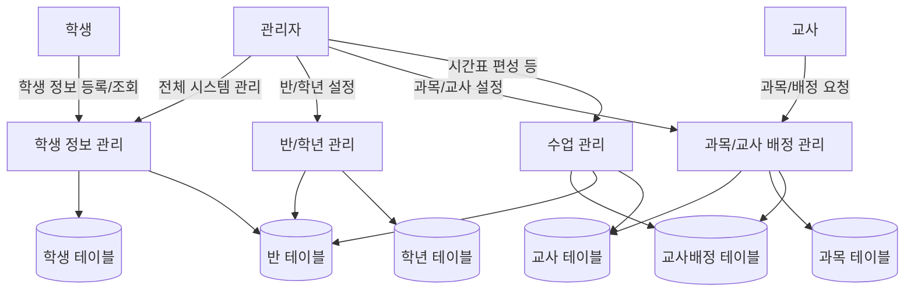

```mermaid
sequenceDiagram
    participant 학생
    participant 관리자
    participant 시스템
    participant DB

    학생->>+시스템: 입학 신청서 제출
    시스템->>+관리자: 신규 입학 요청 알림
    관리자->>+시스템: 입학 승인 및 학년/반 지정
    시스템->>+DB: 학생 정보 INSERT
    시스템->>+DB: 학년 및 반 배정 UPDATE

    시스템->>+관리자: 담임 교사 확인 요청
    관리자->>+시스템: 반에 맞는 담임 교사 지정
    시스템->>+DB: 학생 ↔ 담임 교사 간 연결 (classroom_id로 연결)

    시스템->>학생: 입학 완료 및 반 배정 결과 알림
    학생-->>시스템: 확인

    deactivate 학생
    deactivate 관리자
    deactivate 시스템
    deactivate DB
```


