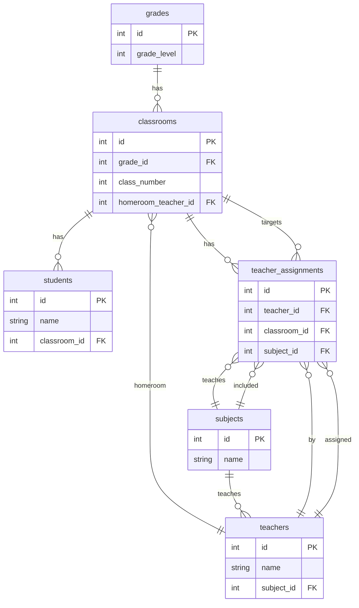

```mermaid
erDiagram

    grades ||--o{ classrooms : "has"
    classrooms ||--o{ students : "has"
    classrooms ||--o{ teacher_assignments : "has"
    classrooms }o--|| teachers : "homeroom"
    subjects ||--o{ teachers : "teaches"
    subjects ||--o{ teacher_assignments : "included"
    teachers ||--o{ teacher_assignments : "assigned"
    teacher_assignments }o--|| classrooms : "targets"
    teacher_assignments }o--|| subjects : "teaches"
    teacher_assignments }o--|| teachers : "by"
    
    grades {
        int id PK
        int grade_level
    }
    
    classrooms {
        int id PK
        int grade_id FK
        int class_number
        int homeroom_teacher_id FK
    }
    
    students {
        int id PK
        string name
        int classroom_id FK
    }
    
    subjects {
        int id PK
        string name
    }

    teachers {
        int id PK
        string name
        int subject_id FK
    }

    teacher_assignments {
        int id PK
        int teacher_id FK
        int classroom_id FK
        int subject_id FK
    }
```
